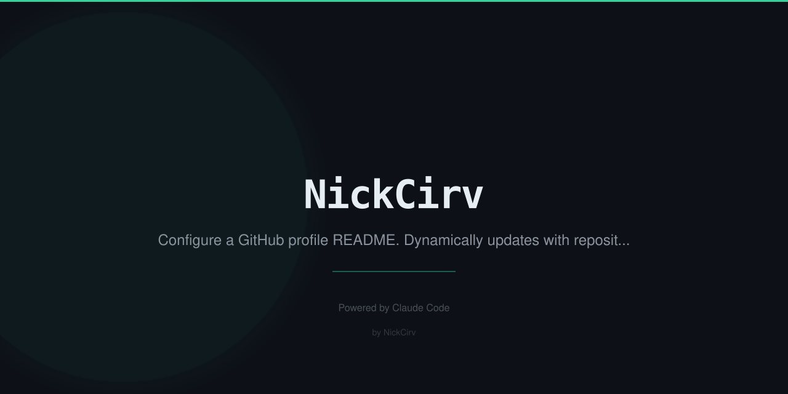

<div align="center">

```
███╗   ██╗██╗ ██████╗██╗  ██╗ ██████╗██╗██████╗ ██╗   ██╗
████╗  ██║██║██╔════╝██║ ██╔╝██╔════╝██║██╔══██╗██║   ██║
██╔██╗ ██║██║██║     █████╔╝ ██║     ██║██████╔╝██║   ██║
██║╚██╗██║██║██║     ██╔═██╗ ██║     ██║██╔══██╗╚██╗ ██╔╝
██║ ╚████║██║╚██████╗██║  ██╗╚██████╗██║██║  ██║ ╚████╔╝
╚═╝  ╚═══╝╚═╝ ╚═════╝╚═╝  ╚═╝ ╚═════╝╚═╝╚═╝  ╚═╝  ╚═══╝
```

**Building developer tools that tell the truth.**
41 open-source CLI tools. Zero dependencies. Node 18+.

[](https://github.com/NickCirv?tab=repositories)
[](https://github.com/NickCirv)
[](https://nodejs.org)
[](https://github.com/NickCirv)

</div>

---

## Git & Code Intelligence

Tools that know your codebase better than you do.

| Tool | What it does | Stars |
|------|-------------|-------|
| [**git-regret**](https://github.com/NickCirv/git-regret) | Scan commits for credentials, Friday deploys, 2am hacks |  |
| [**bus-factor**](https://github.com/NickCirv/bus-factor) | Who needs to be hit by a bus to kill your project? |  |
| [**knowledge-decay**](https://github.com/NickCirv/knowledge-decay) | Find code nobody understands anymore |  |
| [**code-time-machine**](https://github.com/NickCirv/code-time-machine) | See any file as it was at any point in history |  |
| [**commit-confessional**](https://github.com/NickCirv/commit-confessional) | Confess your git sins. Force push penance. |  |
| [**repo-weather**](https://github.com/NickCirv/repo-weather) | Weather report based on your git activity |  |
| [**overengineering-meter**](https://github.com/NickCirv/overengineering-meter) | Galaxy Brain score for your codebase |  |
| [**spaghetti-detector**](https://github.com/NickCirv/spaghetti-detector) | Find circular deps, deep nesting, and architectural debt |  |
| [**variable-shame**](https://github.com/NickCirv/variable-shame) | Audit your codebase for terrible variable names |  |
| [**code-autopsy**](https://github.com/NickCirv/code-autopsy) | Post-mortem analysis for dead code and forgotten files |  |

## AI-Powered Tools

Bring your own `ANTHROPIC_API_KEY`. Zero required.

| Tool | What it does | Stars |
|------|-------------|-------|
| [**agent-chain**](https://github.com/NickCirv/agent-chain) | YAML sequential AI pipelines with `{{previous}}` chaining |  |
| [**context-router**](https://github.com/NickCirv/context-router) | Route tasks to Haiku/Sonnet/Opus. Save money. |  |
| [**multi-persona-review**](https://github.com/NickCirv/multi-persona-review) | 3 AI reviewers in parallel: security, perf, clarity |  |
| [**bug-interviewer**](https://github.com/NickCirv/bug-interviewer) | Socratic AI debugging. It asks questions, you find the bug. |  |
| [**context-diet**](https://github.com/NickCirv/context-diet) | Audit your Claude context window usage |  |
| [**stack-trace-translator**](https://github.com/NickCirv/stack-trace-translator) | Pipe any error in. Get plain English out. |  |
| [**ai-pr-review**](https://github.com/NickCirv/ai-pr-review) | AI code review with configurable personas and focus areas |  |
| [**living-readme**](https://github.com/NickCirv/living-readme) | Auto-update your README from actual code, not your memory |  |
| [**commit-storyteller**](https://github.com/NickCirv/commit-storyteller) | Turn git log into a readable narrative of what changed and why |  |
| [**dashboard-builder**](https://github.com/NickCirv/dashboard-builder) | Generate a terminal dashboard from any data source |  |

## Dev Workflow

Daily tools that make the grind smoother.

| Tool | What it does | Stars |
|------|-------------|-------|
| [**script-runner**](https://github.com/NickCirv/script-runner) | Interactive TUI for package.json scripts |  |
| [**port-sheriff**](https://github.com/NickCirv/port-sheriff) | Manage dev ports. Kill conflicts. Claim your territory. |  |
| [**env-doctor**](https://github.com/NickCirv/env-doctor) | Audit .env files before you commit a secret |  |
| [**feature-flag-cli**](https://github.com/NickCirv/feature-flag-cli) | Local feature flags. No Firebase. No cost. |  |
| [**deploy-gate**](https://github.com/NickCirv/deploy-gate) | Pre-deploy checklist that actually blocks deploys |  |
| [**standup-in-seconds**](https://github.com/NickCirv/standup-in-seconds) | Generate standups from git log |  |
| [**nuke-my-deps**](https://github.com/NickCirv/nuke-my-deps) | Audit and purge unused dependencies from any project |  |
| [**focus-mode**](https://github.com/NickCirv/focus-mode) | Block distractions and track deep work sessions in the terminal |  |
| [**plugin-changelog**](https://github.com/NickCirv/plugin-changelog) | Auto-generate changelogs from structured commit messages |  |
| [**wporg-sentinel**](https://github.com/NickCirv/wporg-sentinel) | Monitor WordPress.org plugin review queue status |  |
| [**readme-shame**](https://github.com/NickCirv/readme-shame) | Grade your README. Public shaming if it's bad. |  |

## Developer Humor (but real)

These will make you laugh, then make you fix things.

| Tool | What it does | Stars |
|------|-------------|-------|
| [**github-roast**](https://github.com/NickCirv/github-roast) | Data-driven GitHub profile roast |  |
| [**commit-horoscope**](https://github.com/NickCirv/commit-horoscope) | Your git history reveals your destiny |  |
| [**imposter-syndrome-detector**](https://github.com/NickCirv/imposter-syndrome-detector) | You're not an imposter. Here's the proof. |  |
| [**dev-bingo**](https://github.com/NickCirv/dev-bingo) | Standup / code review / incident bingo |  |
| [**vibe-check**](https://github.com/NickCirv/vibe-check) | What's your developer archetype? |  |
| [**pr-graveyard**](https://github.com/NickCirv/pr-graveyard) | Funeral for abandoned pull requests |  |

## Team Intelligence

| Tool | What it does | Stars |
|------|-------------|-------|
| [**review-roulette**](https://github.com/NickCirv/review-roulette) | Weighted code reviewer assignment from git blame |  |
| [**meeting-cost-clock**](https://github.com/NickCirv/meeting-cost-clock) | Real-time meeting cost calculator |  |
| [**mrr-tracker**](https://github.com/NickCirv/mrr-tracker) | Track MRR from the terminal |  |
| [**always-shipping**](https://github.com/NickCirv/always-shipping) | Shipping streak accountability |  |

---

<div align="center">

## Tech


## GitHub Stats


---

*All tools: zero dependencies · Node 18+ · MIT license*
*Building in public at [cirvgreen.com](https://cirvgreen.com)*

</div>
