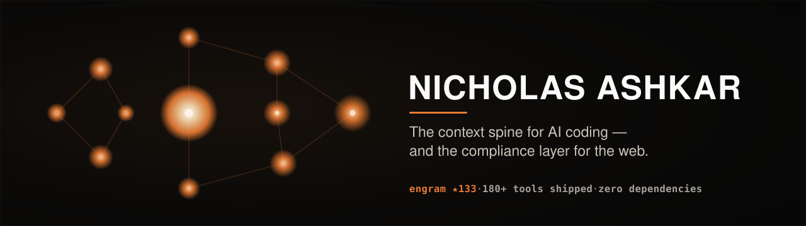

<!--
  Profile README — Wave 0 of the github-portfolio-uplift project.
  Banner: assets/banner.svg (tier-1, aaa-design spatial/knowledge-graph system).
  Engram is featured (linked) but NEVER edited from here.
-->

**Building the context layer for AI coding — and the compliance layer for the web.**

---

I ship two kinds of software: **AI-native developer tooling** that makes coding agents faster and more honest, and **Cirv** — a compliance & SEO SaaS suite live on the official WordPress.org directory and the open web.

## 🧠 AI-Native Developer Tools

> ### ⭐ [engram](https://github.com/NickCirv/engram) — the context spine for AI coding
> The cached context layer that 10×'s every AI coding session. **89% measured token reduction**, live in **8 IDEs** (Claude Code, Cursor, Cline, Continue, Aider, Codex, Windsurf, Zed) via npm + OpenVSX + the Anthropic plugin directory. Local SQLite, zero cloud, Apache 2.0. — **133 ★**

| Tool | What it does |
|------|--------------|
| [**repo-whisperer**](https://github.com/NickCirv/repo-whisperer) | Query any codebase in natural language — precise file references, RAG-powered. |
| [**zero-to-prod**](https://github.com/NickCirv/zero-to-prod) | One command from empty directory to deployed app — scaffold, build, test, ship. |
| [**one-prompt-saas**](https://github.com/NickCirv/one-prompt-saas) | Generate and deploy a full SaaS from a single prompt — auth, billing, the works. |
| [**multi-persona-review**](https://github.com/NickCirv/multi-persona-review) | Review code with three AI personas at once — security, performance, clarity. |
| [**context-router**](https://github.com/NickCirv/context-router) | Route Claude tasks to the right model by complexity — cut credit burn. |
| [**context-diet**](https://github.com/NickCirv/context-diet) | Trim wasted context from Claude Code sessions — smaller windows, lower cost. |
| [**secret-scan**](https://github.com/NickCirv/secret-scan) | Catch exposed secrets pre-commit — API keys and tokens before they ship. |
| [**claude-guard**](https://github.com/NickCirv/claude-guard) | Scan AI-generated code before commit for dangerous patterns. |

## 🛡️ Cirv — Compliance & SEO SaaS

Live on the official **[WordPress.org plugin directory](https://profiles.wordpress.org/cirvgreen/)** + the open web:

| Product | What it does |
|---------|--------------|
| [**Cirv Box**](https://wordpress.org/plugins/cirv-box/) | Schema.org structured-data automation — auto-generates JSON-LD for WordPress. |
| [**Cirv Guard**](https://wordpress.org/plugins/cirv-guard/) | WCAG / ADA accessibility compliance for WordPress sites. |
| [**Cirv Pulse**](https://wordpress.org/plugins/cirv-pulse/) | Site health & performance monitoring. |
| [**Cirv Comply**](https://wordpress.org/plugins/cirv-comply/) | Cookie / GDPR consent compliance. |
| [**cirv-a11y-scanner**](https://github.com/NickCirv/cirv-a11y-scanner) | Free WCAG/ADA checker — scan any URL. Powers Cirv Guard. |
| [**schema-or-die**](https://github.com/NickCirv/schema-or-die) | Validate Schema.org markup — strict 0–100 compliance score. |

Open compliance indexes: [accessibility-index](https://github.com/NickCirv/cirv-accessibility-index) · [cookie-index](https://github.com/NickCirv/cirv-cookie-index) — open WCAG/EAA + GDPR compliance references for EU e-commerce.

## ⚙️ And 180+ more

A deep bench of zero-dependency, single-purpose CLI tools across **git**, **testing**, **HTTP**, **schema**, **env**, and **Claude Code** workflows. [**Browse all repositories →**](https://github.com/NickCirv?tab=repositories)

---

Developer tools that tell the truth · zero dependencies · local-first

