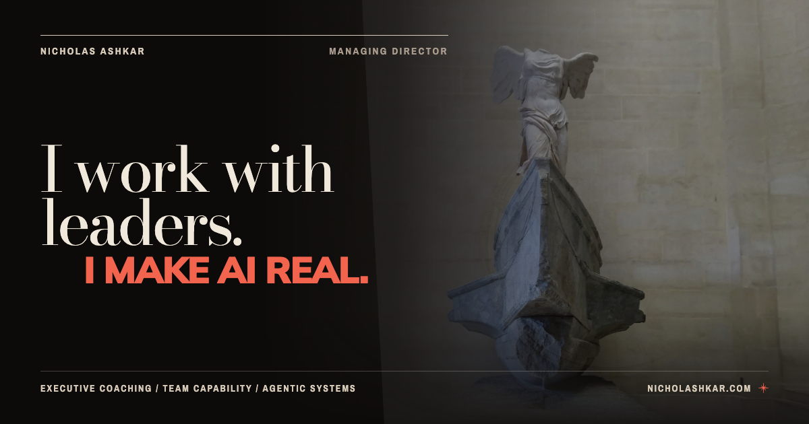

# Nicholas Ashkar

**I work with leaders. I make AI real.**

I work with leaders on leadership effectiveness, team capability, and applied AI. I'm a Managing Director and the founder of [Cirvgreen](https://cirvgreen.com).

For prospective clients and collaborators, these repositories are the inspectable software side of my work. My portfolio brings together the broader experience, selected cases, and ways to work with me.

[Discuss a project](https://nicholashkar.com/#oxblood-contact) · [Explore my work](https://nicholashkar.com) · [Browse the repositories](https://github.com/NickCirv?tab=repositories)

---

## Selected software work

### [engram](https://github.com/NickCirv/engram)

Context infrastructure for AI coding tools. Structural code maps and local memory help agents find relevant code and retain lessons across sessions.

[Read the project](https://github.com/NickCirv/engram#readme) · [Installation](https://github.com/NickCirv/engram/blob/main/docs/install.html)

### [Cirvgreen](https://cirvgreen.com)

WordPress products for structured data, accessibility, site monitoring, and cookie consent. Explore the product documentation for each tool's scope and limitations.

[Cirv Box](https://wordpress.org/plugins/cirv-box/) · [Cirv Guard](https://wordpress.org/plugins/cirv-guard/) · [Cirv Pulse](https://wordpress.org/plugins/cirv-pulse/) · [Cirv Comply](https://wordpress.org/plugins/cirv-comply/)

### [secret-scan](https://github.com/NickCirv/secret-scan)

A local pattern scanner for potentially exposed credentials in added lines of Git history. Findings are review signals, with scope and remediation limits documented in the repository.

### [repo-report-card](https://github.com/NickCirv/repo-report-card)

An inspectable rubric for documentation, structure, basic security patterns, Git history and CI configuration. Its grades describe repository hygiene; they are not software certification.

---

## Explore by problem

| If you want to… | Start here |
| --- | --- |
| Give coding agents better context | [engram](https://github.com/NickCirv/engram), [context-diet](https://github.com/NickCirv/context-diet), [claude-context-pack](https://github.com/NickCirv/claude-context-pack) |
| Review code and repository health | [multi-persona-review](https://github.com/NickCirv/multi-persona-review), [repo-report-card](https://github.com/NickCirv/repo-report-card), [secret-scan](https://github.com/NickCirv/secret-scan) |
| Inspect web quality | [cirv-a11y-scanner](https://github.com/NickCirv/cirv-a11y-scanner), [schema-or-die](https://github.com/NickCirv/schema-or-die), [security-header-check](https://github.com/NickCirv/security-header-check) |
| Work with APIs and data | [api-diff](https://github.com/NickCirv/api-diff), [json-schema-validator](https://github.com/NickCirv/json-schema-validator), [http-mock-recorder](https://github.com/NickCirv/http-mock-recorder) |
| Improve everyday Git workflows | [git-standup](https://github.com/NickCirv/git-standup), [changelog-generator](https://github.com/NickCirv/changelog-generator), [git-digest](https://github.com/NickCirv/git-digest) |

Start with each repository’s purpose, source-backed usage and limitations. Some projects are experiments, and archived repositories remain historical references.

## Work with me

- **Consulting and collaboration:** [start a conversation about leadership, team capability, or applied AI](https://nicholashkar.com/#oxblood-contact). Share the problem, your constraints, and what a useful outcome would look like.
- **Experience and fit:** [background and selected work](https://nicholashkar.com/#oxblood-about).
- **Open-source contributors:** start with a project's README, contribution guidance, and open issues.

---

[nicholashkar.com](https://nicholashkar.com) · [Cirvgreen](https://cirvgreen.com) · [All repositories](https://github.com/NickCirv?tab=repositories)

## Documentation notes

[Source review and editorial scope](docs/RESEARCH.md) records the profile baseline and distinguishes project evidence from biography and product descriptions.

[Artwork credits](assets/nicholas-ashkar/CREDITS.md)
